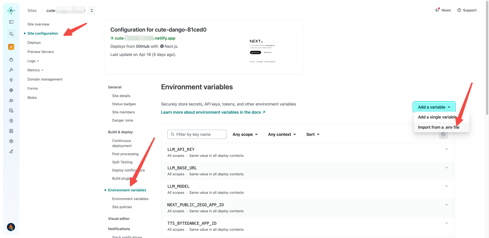
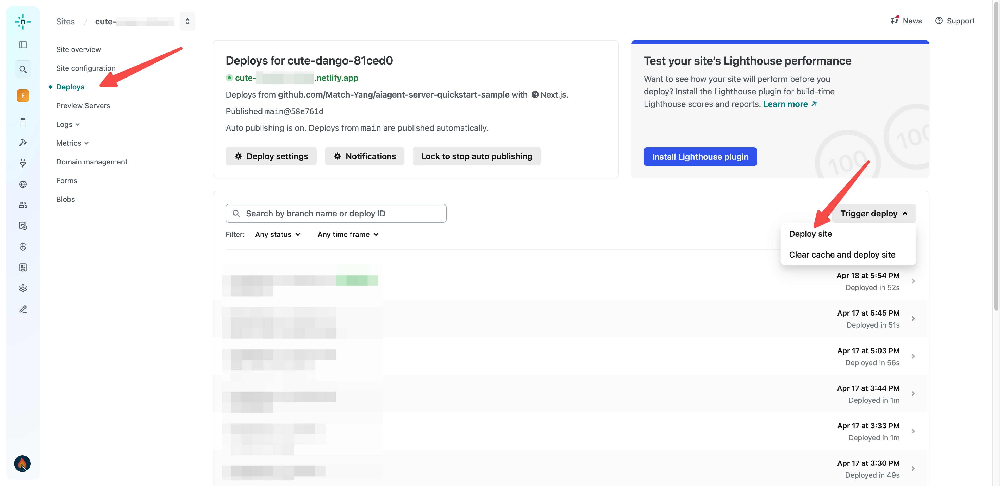
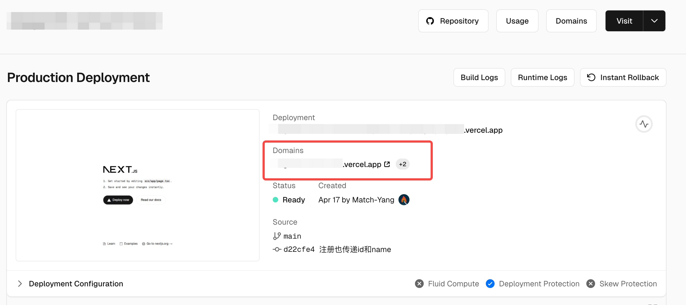

# AI Agent Server Example Usage Guide

[](./README_EN.md) [](./README.md)

- [AI Agent Server Example Usage Guide](#ai-agent-server-example-usage-guide)
  - [Run \& Deployment](#run--deployment)
    - [Running Locally](#running-locally)
    - [Deploy to Netlify](#deploy-to-netlify)
    - [Deploy to Vercel](#deploy-to-vercel)
  - [Using the Service](#using-the-service)
  - [Project Structure](#project-structure)


## Run & Deployment

### Running Locally

You can install the dependencies locally, start the server, and then have clients connect to the relevant interfaces through the same local network.

1. Install [Node.js 18.18](https://nodejs.org/) or above.
2. Download this repository code to your local machine.
3. Copy the `.env.example` file to `.env` and fill in all environment variable values according to the instructions (such as ZEGO APPID, LLM, TTS).
4. Go to the project root directory and run the following commands to start the service.
```bash
npm install
npm run dev
```

After completion, you can open [http://localhost:3000](http://localhost:3000) to see the running result.

Once running successfully, you can call the following interfaces:
- Get ZEGO Token: `http://localhost:3000/api/zego-token`
- Start talking with AI Agent: `http://localhost:3000/api/start`
- Start a video call with the digital human agent: `http://localhost:3000/api/start-digital-human`
- Stop talk with AI Agent: `http://localhost:3000/api/stop`

Note: If you are running the server on a PC/Mac and debugging on mobile devices like Android or iOS, please replace `localhost` with the actual LAN address of your PC/Mac.

### Deploy to Netlify

Please note ⚠️: This method is recommended for users in Mainland China

[](https://app.netlify.com/start/deploy?repository=https://github.com/njzhangsan2013/zego_ai_agent_quick_start_server.git)

Click the button above to deploy this project to the Netlify platform with one click.
During deployment, you need to import all necessary environment variables. The specific steps are as follows:

1. On the Netlify platform, navigate to `Your Site Instance -> Site configuration -> Environment variables`
2. Click `Add a variable` on the right and select `Import from a .env file`, then copy the following content into the input box (Contents of .env file:), and click `Import variables`.
```bash
# AppID and ServerSecret obtained by you from ZEGOCLOUD console（https://console.zegocloud.com/）
NEXT_PUBLIC_ZEGO_APP_ID=
ZEGO_SERVER_SECRET=

# LLM API Key, Base URL and models obtained by you from the LLM service provider
# During the access test period (within 2 weeks after contacting ZEGOCLOUD technical support to activate the AI Agent service), some models can be used directly. Please refer to: https://www.zegocloud.com/docs/aiagent-server/api-reference/common-parameter-description#llm
# During the access test period, the following configurations can be used directly without modification
LLM_BASE_URL=https://ark.cn-beijing.volces.com/api/v3/chat/completions
LLM_API_KEY=zego_test
LLM_MODEL=doubao-1-5-lite-32k-250115
# Agent system prompt（If not configured, the default prompt word will be used）
# LLM_SYSTEM_PROMPT="Question answering requirements: You are role-playing. Please follow the character requirements and directly output the answer. The answer is divided into periods. The maximum length of a single answer is 3 sentences and cannot exceed 100 words. \nRole: Li Yueran\nNickname: Teacher Li"

# Taking ByteDance's TTS as an example, during the access test period (within 2 weeks after contacting ZEGOCLOUD technical support to activate the AI Agent service)
# both the appid and token can be directly filled with "zego_test" to use the TTS (Text-to-Speech) service.
# The following configurations can be used directly without modification during the access test period:
TTS_BYTEDANCE_APP_ID=zego_test
TTS_BYTEDANCE_TOKEN=zego_test
TTS_BYTEDANCE_CLUSTER=volcano_tts
TTS_BYTEDANCE_VOICE_TYPE=zh_female_wanwanxiaohe_moon_bigtts

# For advanced configuration when creating an agent, including configurable interruption modes, please refer to: https://doc-zh.zego.im/aiagent-server/api-reference/agent-instance-management/create-agent-instance
# ADVANCED_CONFIG='{"InterruptMode":1}'

```

3. Go to the `Deploys` page and click `Trigger deploy` on the right, then select the `Deploy site` option to trigger a website rebuild

4. After deployment is complete, you can see your website's domain on the `Site overview` page.


Use this domain to access the API interfaces:
- Get ZEGO Token: `https://cute-******.netlify.app/api/zego-token`
- Start talking with AI Agent: `https://cute-******.netlify.app/api/start`
- Stop talk with AI Agent: `https://cute-******.netlify.app/api/stop`

### Deploy to Vercel

Please note ⚠️: Access to Vercel from Mainland China may be problematic. If you can't access it, please use a VPN. After deployment, binding your own domain to the service can also allow normal access (be aware of the risk of domain blocking).

[](https://vercel.com/new/clone?repository-url=https%3A%2F%2Fgithub.com%2FZEGOCLOUD%2Fai_agent_quick_start_server&env=NEXT_PUBLIC_ZEGO_APP_ID,ZEGO_SERVER_SECRET,LLM_API_KEY,LLM_BASE_URL,LLM_MODEL,TTS_BYTEDANCE_APP_ID,TTS_BYTEDANCE_TOKEN,TTS_BYTEDANCE_CLUSTER,TTS_BYTEDANCE_VOICE_TYPE&envDescription=这些是启动ZEGO的AI代理服务器所需的环境变量。请查看下方文档获取更多信息。&envLink=https://github.com/zegoim/aiagent-server-quickstart-sample/blob/main/.env.example)

Click the button above to deploy this project to the Vercel platform with one click. During deployment, you need to fill in all necessary environment variables. For detailed explanations of the environment variables, please refer to the [.env.example](.env.example) file.



Use this domain to access the API interfaces:
- Get ZEGO Token: `https://****.vercel.app/api/api/zego-token`
- Start talking with AI Agent: `https://****.vercel.app/api/start`
- Start a video call with the digital human agent: `https://****.vercel.app/api/start-digital-human`
- Stop talk with AI Agent: `https://****.vercel.app/api/api/stop`

## Using the Service

The client needs to integrate the ZEGO Express SDK and join the same room with the AI agent instance to perform publish and play streaming for voice interaction. Therefore, the steps to use this service are as follows:
1. The client calls the `/api/api/zego-token` interface to obtain the ZEGO Token, which is used to log in to the room using the ZEGO Express SDK.
2. The client enters the room, performs publish and play streaming, and calls the `/api/api/start` interface to notify the AI Agent service to create an AI agent instance (In this example, the roomID, userID, and streamID are already predefined, so no parameters need to be passed).

After these two steps, you can interact with the AI agent using voice on the client.

When you need to end the call, call the `/api/api/stop` interface to notify the AI Agent service to delete the AI agent instance.

## Project Structure

The project source code structure is as follows:

```
src
├── app
│   ├── api
│   │   ├── callback
│   │   │   └── route.ts        # Callback interface handling. Contact ZEGO technical support for configuration to receive callback events.
│   │   ├── passthrough-request
│   │   │   └── route.ts        # Passthrough request handling
│   │   ├── start
│   │   │   └── route.ts        # Start AI Agent instance
│   │   ├── stop
│   │   │   └── route.ts        # Stop AI Agent instance
│   │   └── zego-token
│   │       └── route.ts        # ZEGO Token generation interface
└── lib
    ├── logger.ts               # Logging tool
    └── zego
        ├── aiagent.ts          # ZEGO AI Agent PaaS interface request logic
        └── token_helper.ts     # ZEGO Token generation tool
```
